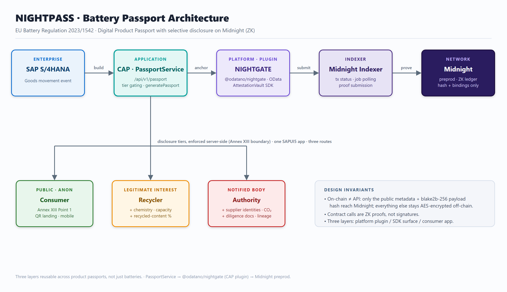

# @odatano/passport - NIGHTPASS

**EU Battery Regulation 2023/1542 Digital Product Passport with three disclosure tiers, backed by zero-knowledge attestations on Midnight.**

[](https://cap.cloud.sap/)
[](https://midnight.network/)
[](https://github.com/ODATANO/NIGHTGATE)
[](https://catena-x.net/)
[](https://eur-lex.europa.eu/eli/reg/2023/1542/oj)

`NIGHTPASS` implements the EU Battery Passport and answers one dataset with a different view per audience (**consumer / recycler / authority**), while proving sensitive claims (e.g. "recycled cobalt share ≥ threshold") *without revealing the underlying value*. Public metadata plus a payload hash are anchored on-chain; everything else stays encrypted off-chain, and the disclosure tier is enforced at the API layer.

It consumes [`@odatano/nightgate`](https://github.com/ODATANO/NIGHTGATE) as a CAP plugin (via `cds.requires.nightgate`). Platform functionality is never reimplemented here.

## The problem

The EU Battery Regulation mandates a Digital Product Passport per battery, but its data carries conflicting disclosure rules, so a single dataset must answer different audiences with different views:

| Tier | Audience | Annex XIII scope |
|---|---|---|
| **consumer** | public / phone scan | Point 1 (public metadata) + QR |
| **recycler** | legitimate-interest parties | + cell chemistry, capacity, recycled-material shares (Points 2/3) |
| **authority** | regulators | + supplier identities, carbon footprint, due-diligence docs, on-chain lineage |

On top of that, some claims (e.g. "recycled cobalt share ≥ threshold") must be **provable without revealing the value**, which reveal/hide credentials cannot express. That capability is delivered as a **Predicate Attestation Credential (PAC)** (see [Catena-X integration](#catena-x--tractus-x-integration)).

## Architecture

A five-layer pipeline: **SAP → CAP → NIGHTGATE → Midnight Indexer → Midnight chain**, with the three disclosure UIs branching off the CAP layer.



Full write-up in [`docs/architecture.md`](docs/architecture.md) (≈10-min read). The SVG (`docs/architecture.svg`) is the source of truth for the rendered PNG.

**On-chain vs off-chain.** Only a `payloadHash` (blake2b-256) and the `passportId → payloadHash` binding go on-chain; the sensitive payload is AES-256-GCM encrypted off-chain. Midnight has only public ledger state (plaintext for all) and private witness state (client-side), so the chain physically cannot hold tier-restricted cleartext. The split is deliberate: **verifying a claim** and **authorizing a tier** move on-chain; **delivering tier-specific cleartext** stays off-chain in the API layer.

**On-chain tier entitlement (NIGHTGATE 0.3.4).** The AttestationVault `disclosures` ACL (`grantDisclosure` / `revokeDisclosure`, levels 0/1/2 = consumer/recycler/authority) is a tamper-evident, revocable entitlement registry. NIGHTGATE indexes it into `midnight.DisclosureGrants` and binds principals to grantee ids via `midnight.GranteeIdentities`. The tier gate in `srv/passport-service.ts` consults this ACL: an active on-chain grant **elevates** a requester's tier above their CAP role, scoped **per passport** (by `payloadHash`) so one passport's grant never leaks onto another. Elevation is additive and degrades to the local role on any lookup failure.

## Quick start

```bash
npm install
cp .env.example .env   # then set ENCRYPTION_KEY (.env is gitignored)
npm run deploy   # creates db/passport.db: domain tables + the 23 midnight_* plugin tables
npm start        # cds-tsx serve  →  http://localhost:4004
```

Working on the repo? See [`docs/development.md`](docs/development.md) for local-dev gotchas (the TS loader requirement, plugin linking).

### Services on :4004

| Service | Path | Source |
|---|---|---|
| PassportService | `/api/v1/passport` | this repo (`srv/`) |
| NightgateService (+ indexer / analytics / admin) | `/api/v1/nightgate` | `@odatano/nightgate` plugin |
| Passport UI (3 tiers) | `/passport/webapp/` | `app/passport/webapp/` |

### Disclosure tiers (dev auth)

In development, auth is `mocked`. Anonymous requests resolve to **consumer**; log in as `recycler` / `recycler` or `authority` / `authority` (authority ⊇ recycler) to widen the view. The boundary is enforced server-side by `after READ` handlers in `srv/passport-service.ts` that redact restricted fields per tier; an active on-chain grant elevates the tier per passport.

### QR resolver

`GET /p/:passportId` reads Basic-Auth to pick the tier and 302-redirects into the SAPUI5 app; `GET /qr/:file.png` renders a QR PNG on the fly for the current host.

## How a passport is created

`generatePassport(batchId, sessionId?)` builds a batch, computes a blake2b-256 `payloadHash` (+ `passportIdHash`), AES-256-GCM-encrypts the payload (HKDF key from `ENCRYPTION_KEY` + passportId), and produces a QR URL. With a `sessionId` it anchors on-chain via the plugin (`anchorDocument` + `bindPassport` / `submitContractCall`), polls `getJobStatus`, then inserts the row. The offline path is live-verified; the on-chain run requires a wallet + DUST + a proof server on preprod.

## Contracts (Compact / Midnight)

`contracts/passport-attestation/src/passport-attestation.compact` carries the AttestationVault pattern (attest / grant / revoke / commitValue / provePredicate) plus a `bindPassport` circuit that anchors `passportId → payload_hash`. It is re-embedded here (not inherited) because Compact cannot inherit ledger state across contracts.

The Compact toolchain runs **only via WSL** on this machine (the `compact` on the Windows PATH is the NTFS compression tool, not the Midnight compiler):

```bash
wsl -e bash -lc 'export PATH=$HOME/.local/bin:$PATH; \
  cd /mnt/c/<path-to-repo>/contracts/passport-attestation && \
  compact compile src/passport-attestation.compact src/managed/passport-attestation'
```

## Catena-X / Tractus-X integration

Catena-X is the automotive-industry dataspace standard (Tractus-X is its Eclipse reference implementation); the Battery Passport is use case **CX-0143**. Tractus-X has no zero-knowledge / predicate / range-proof capability; the closest, the draft Data Trust & Security KIT AAC-SD, only does attribute reveal/hide via BBS+. NIGHTPASS targets that gap, exposing the passport into the dataspace as a **Predicate Attestation Credential (PAC)**, the missing `zkPredicate` mode (prove `value ≤ threshold` without revealing the value). The intended attach point is a new credential profile beside AAC, riding the Digital Twin Registry `/credential` discovery convention over the EDC data plane. The PAC glue lives in `tractusx/`; the ZK primitive lives in the NIGHTGATE plugin (`issuePredicateAttestation` / `verifyPredicateAttestation`).

**Verification model.** Verification is currently **indexer-trust**: the consumer confirms the `provePredicate` transaction was included and succeeded (the ledger only accepts the tx if the in-circuit asserts held, so a successful tx *is* the proof). This relies on NIGHTGATE's own indexer, which must be **enabled and caught up** (the crawler is disabled in the current config). Trust depends on *whose* indexer: a self-sovereign verifier must run their own NIGHTGATE or point at a neutral Midnight indexer, not the issuer's. Portable verifier-key-only verification is deferred because Midnight exposes no standalone off-chain proof verifier.

## Repository layout

```
db/passport-schema.cds              Passports / Batteries / RecycledMaterials / DiligenceDoc (Annex XIII tier comments)
db/data/passport-*.csv              CSV seeds
srv/passport-service.{cds,ts}       PassportService + generatePassport + tier-gating handlers
srv/server.ts                       QR + resolver Express routes (cds.on bootstrap)
app/passport/webapp/                SAPUI5 Freestyle app, one app / three routes (consumer, recycler, authority)
contracts/passport-attestation/     Compact contract (bindPassport + AttestationVault pattern) + managed ZK artefacts
docs/                               architecture.svg/png/md
tractusx/pac/                       Predicate Attestation Credential glue + indexer-trust verify demo
```

## Scripts

| Command | What it does |
|---|---|
| `npm start` | Serve via `cds-tsx serve` (the only correct way, see note above) |
| `npm run deploy` | Deploy the merged model to `db/passport.db` |
| `npm run pac:demo` | Build a Predicate Attestation Credential and verify it the portable way (`tractusx/pac/build-pac.mts`) |

## Status

**Working and verified:** NIGHTGATE plugin mount (23 `midnight_*` tables + both services on :4004); domain schema with Annex XIII tier comments and nested `$expand`; the `passport-attestation` Compact contract (6 circuits / 28 managed artefacts, registered and deploy-ready); the three disclosure UIs with server-side tier gating (browser smoke 12/12 green); QR + resolver; architecture docs.

**In test / pending live run:** `generatePassport` is live-verified on the offline path (200 + row with 64-hex hashes + encrypted cipher; duplicate → 409, unknown batch → 404); the on-chain run with a wallet is outstanding, blocked on a running proof server (`:6300`). The PAC verify demo (`verifyPredicateViaIndexer` in `tractusx/pac/`) returns correct `verified:false` until a proven predicate attestation exists.

## Glossary

- **PAC** (*Predicate Attestation Credential*): the credential NIGHTPASS/NIGHTGATE introduces, providing the `zkPredicate` mode, a zero-knowledge predicate proof (e.g. "recycled share ≥ X%") that proves the statement **without disclosing the value**. Attaches as its own profile beside AAC.
- **AAC** (*Attribute Attestation Credential*, AAC-SD): the Tractus-X Data Trust & Security KIT credential profile. Reveals or hides attributes via BBS+, but has no "prove a property without revealing the value" mode, the gap NIGHTPASS fills.
- **EDC** (*Eclipse Dataspace Connector*): the standard component for sovereign data exchange, separating the control plane (policy negotiation) from the data plane (transfer). PAC is delivered over the data plane.
- **BBS+**: a selective-disclosure signature scheme (BBS over BLS12-381, multi-message variant). Supports reveal/hide and unlinkable presentations, but **cannot** produce predicate proofs, the capability AAC-SD lacks and PAC adds.
