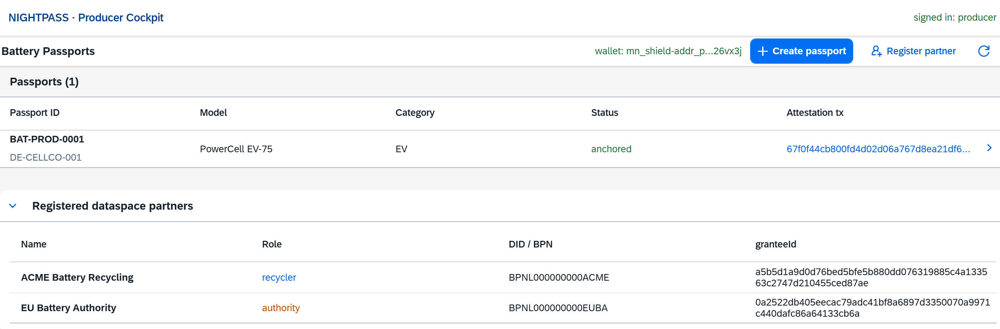
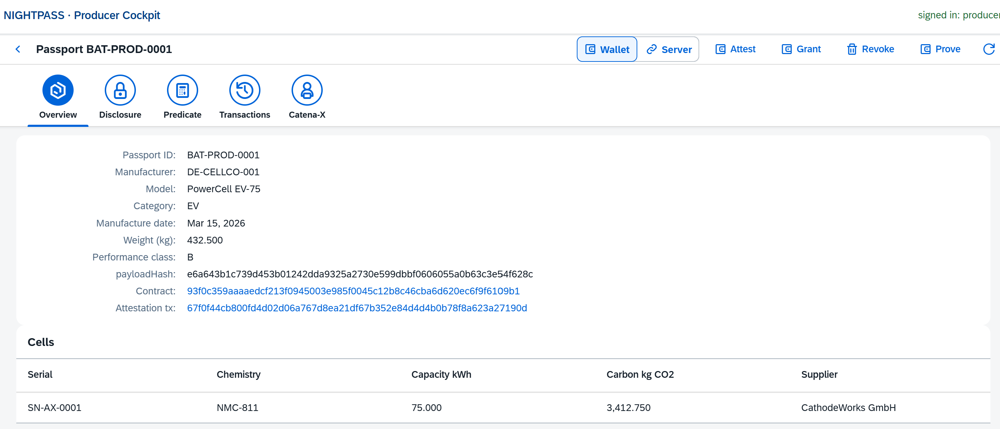
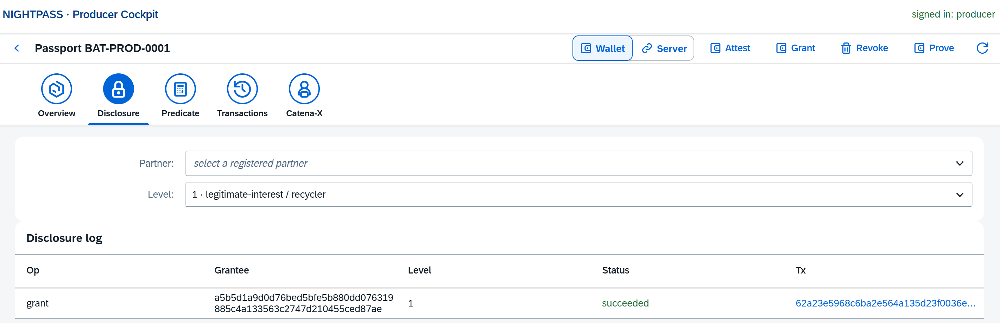
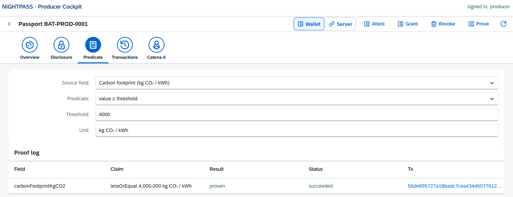
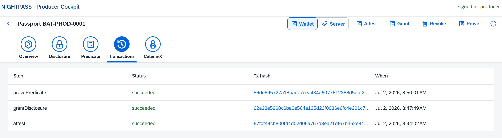
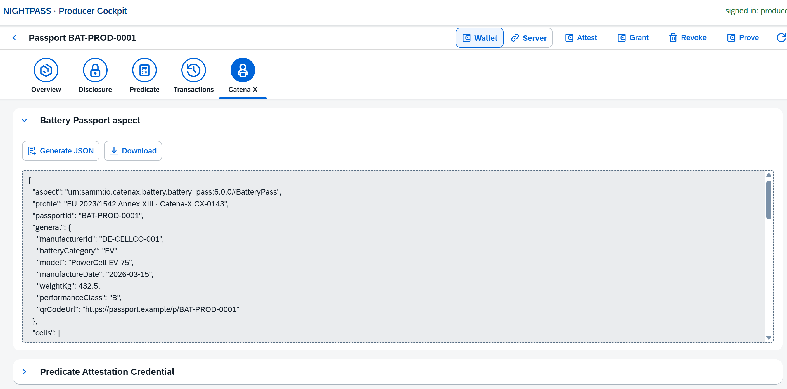
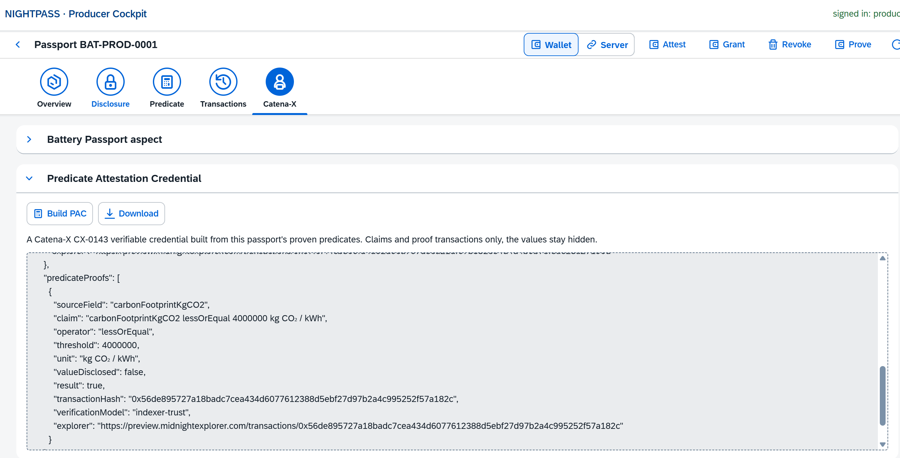

# Producer cockpit walkthrough

The producer cockpit is the manufacturer / ERP write surface: create a battery passport, anchor it on Midnight, manage disclosure grants, and prove field values in zero-knowledge. Open it at `/producer/webapp/index.html` and sign in as `producer`.

The passport list after signing in and connecting a wallet: your own passports with their anchored status and attestation tx, the Create passport and Register partner actions, and the registered dataspace partners below.

Every action runs one of two ways, selected by the Wallet / Server toggle at the top of a passport:

- **Wallet**: signed from your own Lace wallet (interactive, with popups).
- **Server**: signed in the background by the server wallet (async jobs, no popups).

Grant, Revoke and Prove stay disabled until the passport is anchored on-chain, so Attest runs first. Without a signing session everything still records locally as an offline log row.

## Create a passport

From the main list, Connect wallet (this scopes the list to your own passports), then New passport. The dialog is grouped into collapsible sections (General, Cell / battery, Due diligence, Recycled materials). Save writes a draft.

## Overview

The passport header, the on-chain contract and attestation transaction (linked to the Preview Explorer once anchored), and the battery cells. The top bar carries the mode toggle and the Attest / Grant / Revoke / Prove actions.

Attest anchors three transactions in one flow: `attest` (locks the payload hash under the attester identity), `bindPassport` (binds `passportId` to `payloadHash` for QR resolution), and `anchorContentRoot` (the Merkle root over the provable fields, which later field-bound proofs bind to).

## Disclosure

Grant or revoke a disclosure tier to a registered partner. Pick the partner and a level (0 consumer, 1 recycler, 2 authority), then Grant or Revoke from the top bar. The grant is recorded on-chain and mirrored to the disclosure log, and the consumer read side elevates that partner's view for this passport only.

## Predicate

Prove a field value against a threshold without revealing it. Pick a source field (the dropdown auto-fills a sensible operator, threshold and unit), then Prove. The proof recomputes the field's Merkle leaf and binds it to the anchored content root, so the proven value provably comes from this passport and not an arbitrary number. The proof log shows the claim, the result (proven or false) and the transaction. A value that fails the predicate is rejected in-circuit and recorded as a failed proof.

## Transactions

Every submitted step for this passport (attest, grant, prove, and so on) with its status and a link to the transaction on the Preview Explorer, newest first.

## Catena-X: aspect JSON

Generate JSON builds the EU 2023/1542 / Catena-X battery-passport aspect from the passport (general, cells, recycled content, due diligence, on-chain integrity). Download saves it as `<passportId>-aspect.json`.

## Catena-X: Predicate Attestation Credential

Build PAC assembles a Catena-X CX-0143 verifiable credential from the passport's proven predicates: one entry per claim (operator, threshold, unit, proof transaction, `verificationModel: indexer-trust`) with `valueDisclosed: false`, so the values stay hidden. Download saves `<passportId>-pac.json`.

